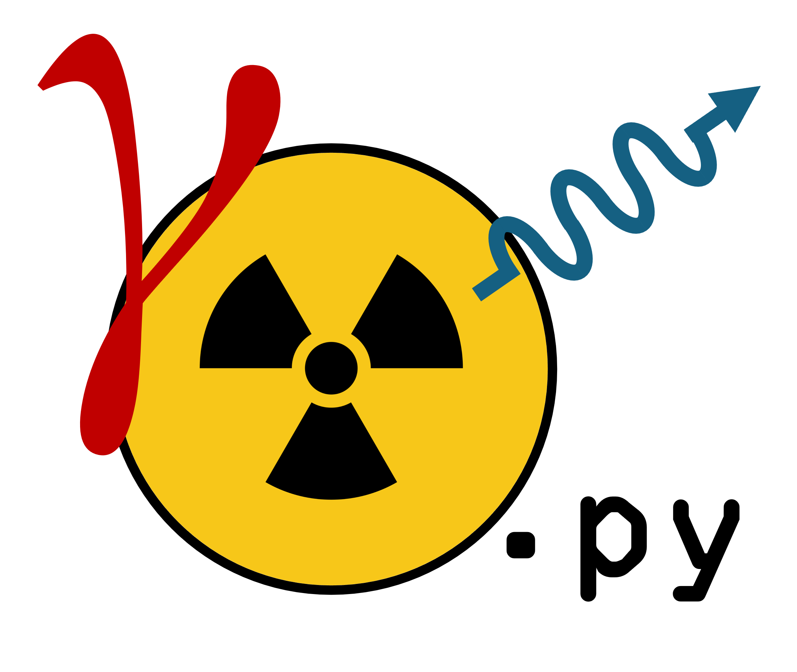

<table border="0">
 <tr>
    <td></td>
    <td><b style="font-size:40px">PyGammaSpec</b></td>
 </tr>
</table>

___

PyGammaSpec is a simple python library developed to process gamma ray spectroscopy data obtained from scintillation detectors.

